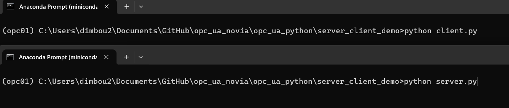

# demo of opc ua async library
## setting up a demo server and client

create an anaconda enviroment, activate it and install the requirements 

    conda create -n opcua_demo python=3.12.2

    conda activate opcua_demo

    pip install -r requirements.txt

Now two terminals need to be open at the same time one for the server one for the client

trminal one:

    python server.py

terminal two:

    python client.py

before running you should have something like this

  

Now you should see the values that are being printed on the server change

